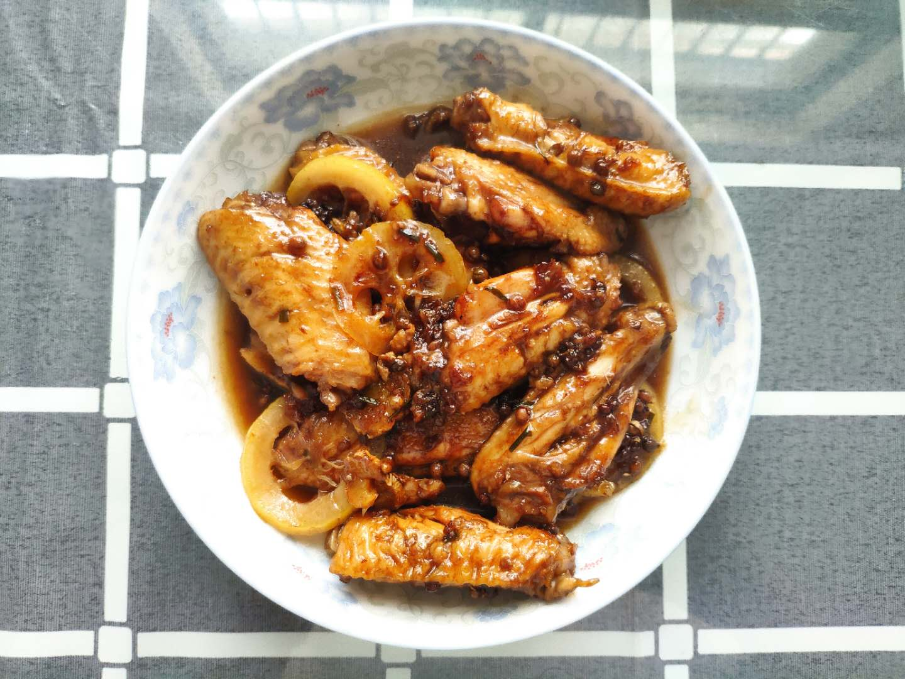

非常规做法，味道丰富啊

## 材料

鸡翅、柠檬、可乐、葱、姜、花椒、生抽

## 方法

1. 鸡翅+柠檬片+可乐，腌制30min

2. 鸡翅和柠檬取出，冷水下锅煮沸3min

   <!--more-->

3. 鸡翅取出冷水洗净沥干

4. 冷油下锅，鸡翅煎至两面金黄

5. 加入可乐没过鸡翅

6. 加入葱姜、花椒、生抽两勺

7. 中火10min，最后大火收汁

## 结果与讨论

由于加了花椒和柠檬，整体味道层次还蛮丰富。总体来说味道深得我心。

不足在于油煎过程的油放少了，导致粘锅，以致进一步的一些鸡翅受损；且没有等到完全煎至黄色，应该是对结果产生里不利影响。

收汁的过程，由于泡沫过多也有些难以控制，第一次做的时候还补加了水。

## 展望

下次最好使用平底锅做；油应多放一些。

可以尝试加入其它辅料，如鸡蛋、薯片等。

做了10个，量偏低，今后15个起步。