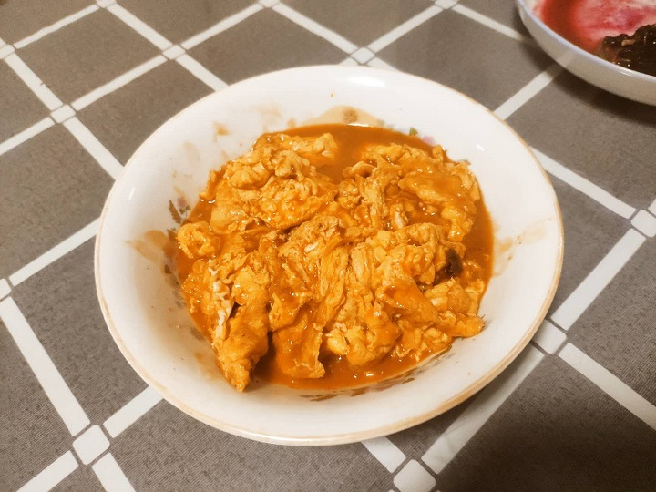

纯炒鸡蛋，无敌下饭

## 材料：

鸡蛋*5、淀粉、生抽、陈醋、耗油、白糖、辣椒粉

## 方法

1. 五个鸡蛋打散，出现泡沫为止；
2. 调配料：淀粉一勺，生抽两勺，陈醋两勺，耗油一勺，白糖一勺，辣椒粉一勺，加入一小碗清水，搅拌均匀；
3. 起锅烧油！八成油温下鸡蛋，小火慢炒至微成型；
4. 加入调料，翻炒至收汤；
   <!--more-->
5. 结束

## 结果与讨论

第一次的配料完全按照上述方法，结果完全符合预料的好吃，只不过稍微有点咸，但可以被其它好的味道掩盖；

第二次少加了一些生抽，导致味道明显变淡，不好吃。

## 展望

基本没有上升空间了