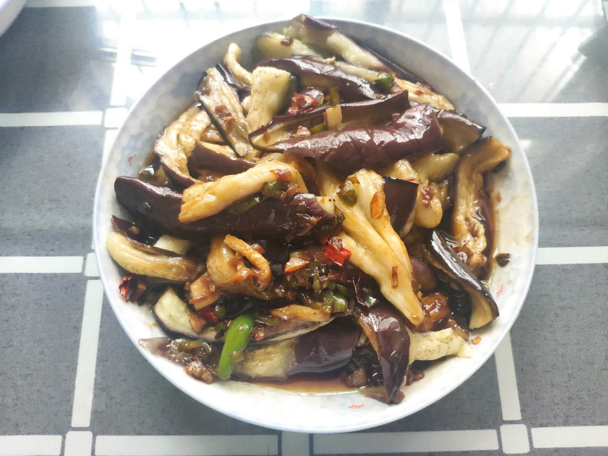

撕起来很烫

## 材料

茄子、青椒、大蒜头、红辣椒、生抽、醋、白糖、盐、香油

## 方法

1. 茄子切块，蒸锅蒸15min，撕成条状摆盘

2. 调料汁：两勺生抽，两勺陈醋，一勺白糖，少量盐，香油适量

   <!--more-->

3. 油锅下入蒜末、小米辣、青椒，翻炒后倒入料汁10s

4. 料汁淋上茄子

## 结果与讨论

与料汁有亲密接触的茄子属实可以。问题在于出现了失误，茄子的量过多，导致按教程调的料汁不能满足茄子的需求。

尝试通过调两份料，出现的第二个问题是油未控制好，两次炒制都放了3勺半的油。最后的成品更像是一个油焖茄子，不够绿色健康。

任重而道远啊，这次不算成功！