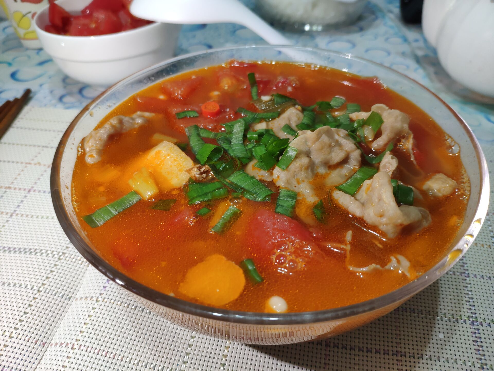

番茄肥牛金针菇的汤，好喝死！

## 材料

肥牛卷、西红柿、番茄酱、金针菇、葱、姜、蒜、盐、生抽

## 方法

1. 西红柿煮开水去皮切块，争取小碎块

2. 牛肉卷煮熟去血沫，放到碗里备用

3. 油锅下葱姜蒜，切片爆香，油不能太多

   <!--more-->

4. 加入切好的西红柿，挤进去番茄酱，倒两勺生抽，把番茄炒至软烂

5. 加入开水，水开后加入煮好的牛肉和金针菇

6. 加一勺盐，继续煮开五分钟

## 结果与讨论

好像牛肉多煮一会也不会太老啊。

整体都很好吃，可惜这一次做的时候姜味有点太重了，不能放太大的姜片进去了。

图片中的作品由48块钱的肥牛卷的一半+一个番茄+常见销售的金针菇的一半构成，以供以后参考。