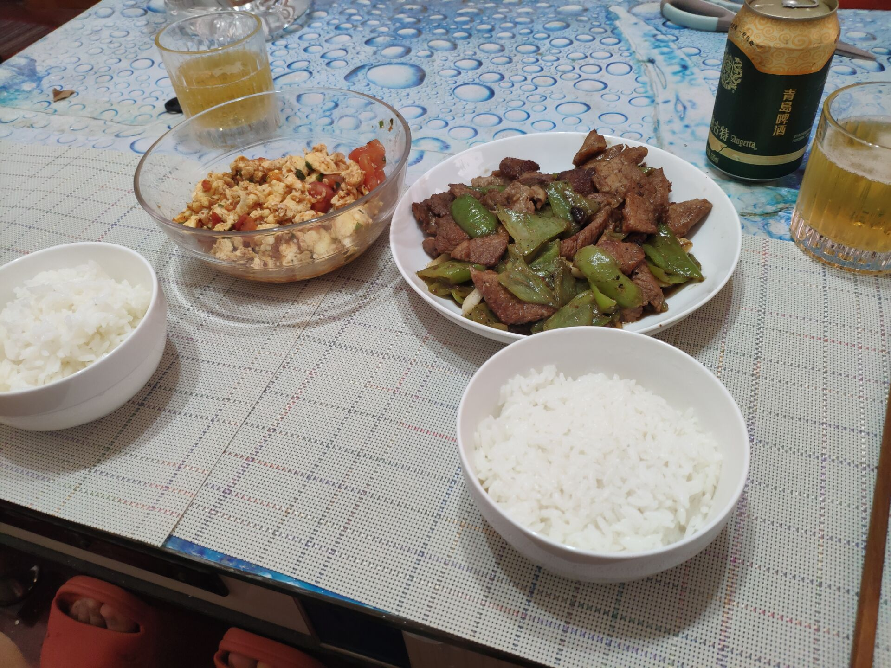

青椒炒肉！吃的爽啊

## 材料

青椒、猪肉、老抽、生抽、料酒、盐、大蒜

- 猪肉最好是带点肥肉的前腿/后腿肉。要求瘦的地方绝对的瘦。

- 其中，青椒的优先级如图所示：

  <!--more-->

## 方法

1. 处理猪肉。肥瘦肉分离，瘦肉切片后加入料酒、老抽、生抽，腌一把游戏的时间。
2. 辣椒和蒜头切片。其中辣椒掏籽+滚刀。
3. 干煸辣椒。不放油，中火加入辣椒片，放点盐使劲炒，直到表面起皱，出现虎皮。

4. 锅里放一点油，放进肥肉片煸油直到变得焦焦干干。
5. 放进瘦肉片大火翻炒，变色后放进大蒜片，*可以再加点豆豉*。
6. 辣椒倒进去一起继续翻炒，用铲子擂肉片和辣椒片。持续40s
7. 放进生抽再炒15秒，关火！

## 结果与讨论

其实还真的蛮好吃的，不过就是肉片有点太厚了，还好都熟了。

真的稍微辣点的辣椒很下饭啊。